# DSO101 Assignment 1 - Todo App CI/CD

**Student Name:** Dechen Yangzom  
**Student Number:** 02240338  
**Submission Folder:** DechenYangzom_02240338_DSO101_A1

---

## Project Structure
DechenYangzom_02240338_DSO101_A1/
├── backend/
│   ├── .env
│   ├── .dockerignore
│   ├── .gitignore
│   ├── Dockerfile
│   ├── server.js
│   ├── package.json
├── frontend
│   ├── src/
│   │   ├── App.js
│   ├── .dockerignore 
│   ├── .env
│   ├── gitignore
│   ├── Dockerfile
│   ├── package.json
│   └── README.md
├── README.md
└── render.yaml

---

## Step 0: Running Locally

### Prerequisites
- Node.js v18+
- PostgreSQL
- Docker Desktop
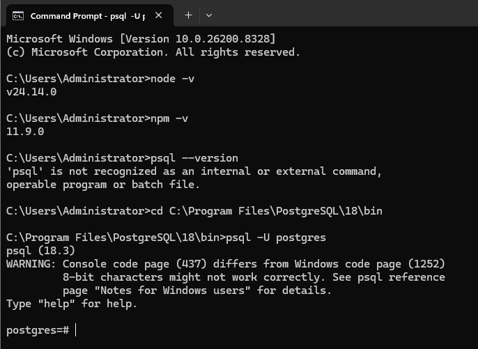
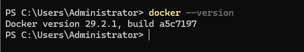
### 1. Set up the database
```sql
CREATE DATABASE todos;
```
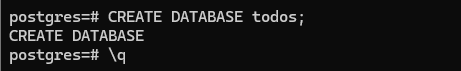

### 2. Configure environment variables
```bash
# Backend .env
DB_HOST=localhost
DB_USER=postgres
DB_PASSWORD=yourpassword
DB_NAME=todos
DB_PORT=5432
DB_SSL=false
PORT=5000
```
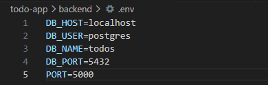

```bash
# Frontend .env
REACT_APP_API_URL=http://localhost:5000
```
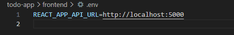

### 3. Start the backend
```bash
cd backend
npm install
node server.js
```
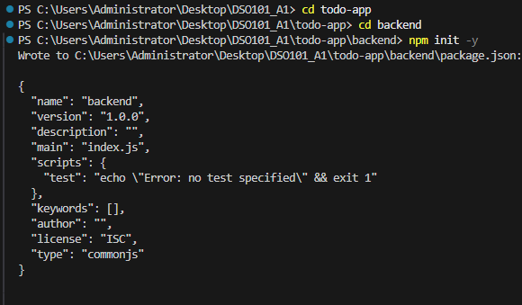
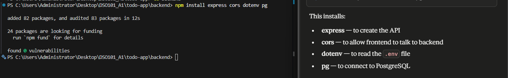
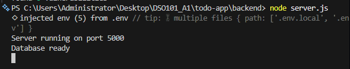


### 4. Start the frontend
```bash
cd frontend
npm install
npm start
```
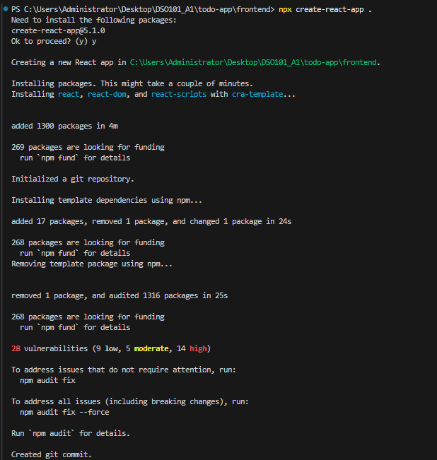
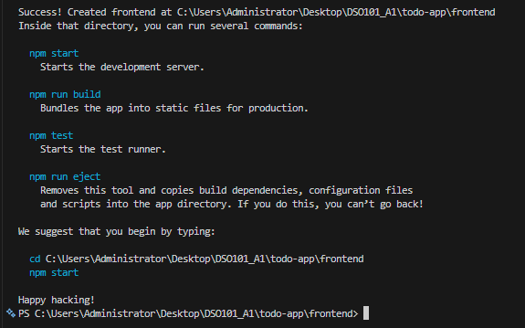


### Screenshot: Local app running
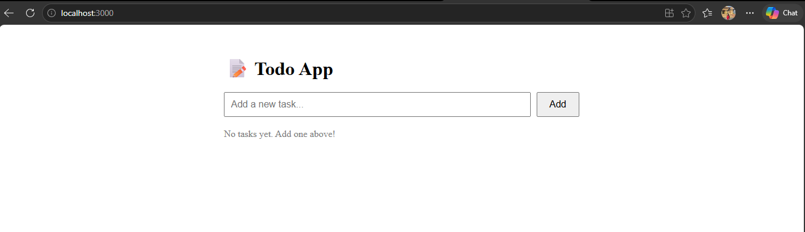
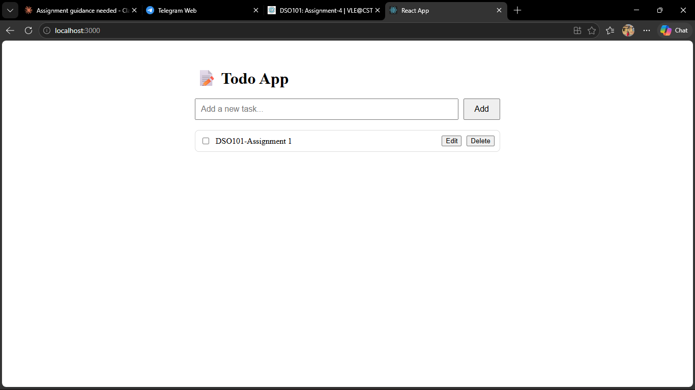
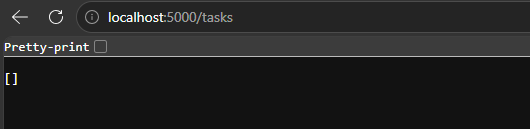


---

## Part A: Docker Hub Deployment

### 1. Build Docker images
```bash
docker build -t 02240338/be-todo:02240338 ./backend
docker build -t 02240338/fe-todo:02240338 ./frontend
```

### Screenshot: Docker build
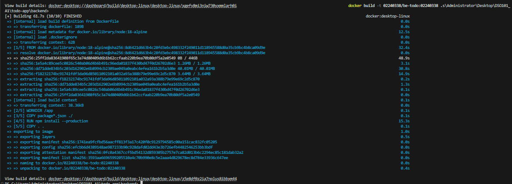
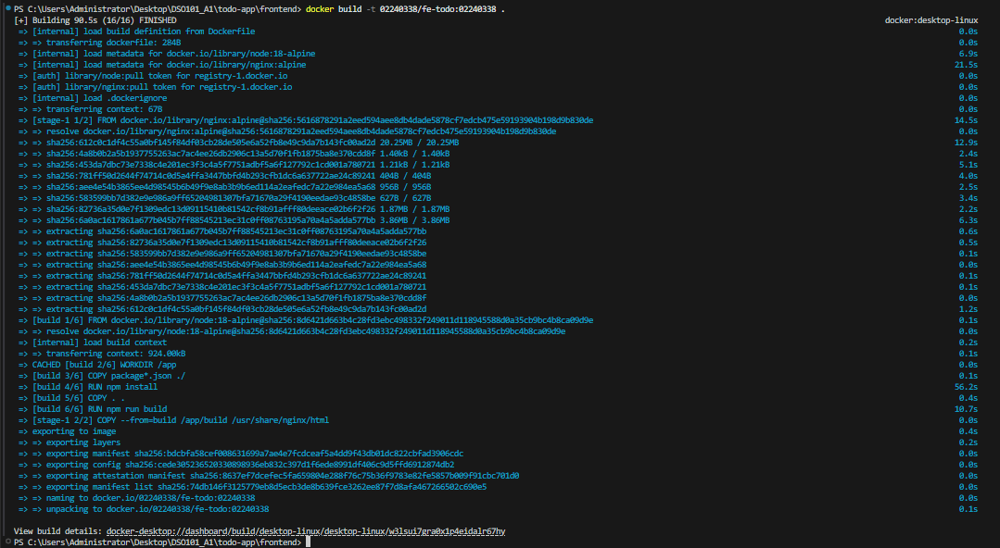


### 2. Push to Docker Hub
```bash
docker push 02240338/be-todo:02240338
docker push 02240338/fe-todo:02240338
```
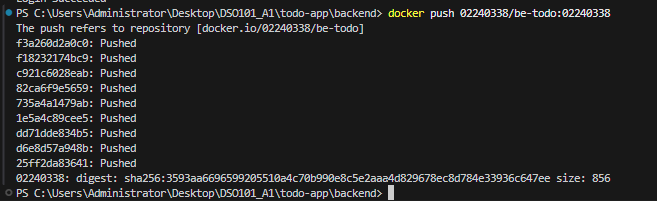


### Screenshot: Docker Hub images


### 3. Deploy on Render.com

#### Backend Service
- Image: `02240338/be-todo:v7`
- URL: https://be-todo-02240338.onrender.com

#### Frontend Service
- Image: `02240338/fe-todo:v2`
- URL: https://fe-todo-v2.onrender.com

### Screenshot: Backend deployed on Render


### Screenshot: Frontend deployed on Render


### Screenshot: Live app working


---

## Part B: Automated Git-based Deployment

### render.yaml
```yaml
services:
  - type: web
    name: be-todo
    env: docker
    dockerfilePath: ./backend/Dockerfile
    envVars:
      - key: DATABASE_URL
        sync: false
      - key: PORT
        value: 5000

  - type: web
    name: fe-todo
    env: docker
    dockerfilePath: ./frontend/Dockerfile
    envVars:
      - key: REACT_APP_API_URL
        value: https://be-todo-02240338.onrender.com
```

### How it works
Every time code is pushed to GitHub, Render automatically:
1. Detects the new commit
2. Rebuilds Docker images using Dockerfiles
3. Redeploys both services

### Screenshot: Blueprint synced on Render


### Screenshot: Auto-deploy triggered by git push


---

## Live URLs
- Frontend: https://fe-todo-v2.onrender.com
- Backend: https://be-todo-02240338.onrender.com

---

## References
- [Docker Documentation](https://docs.docker.com/)
- [Render Documentation](https://render.com/docs)
- [Render Blueprint Spec](https://render.com/docs/blueprint-spec)